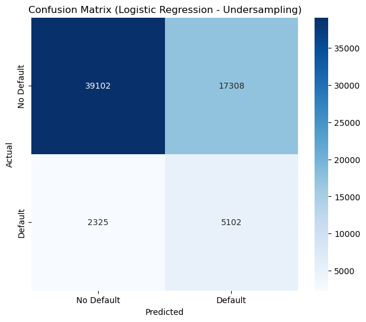
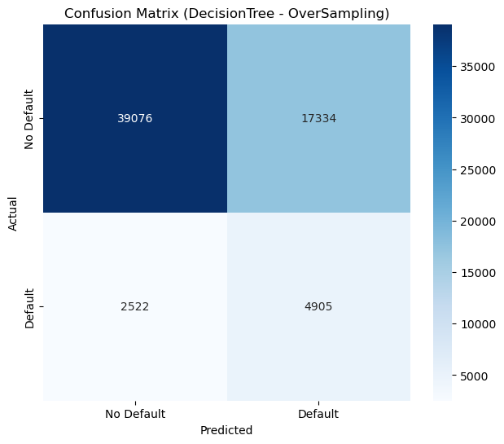
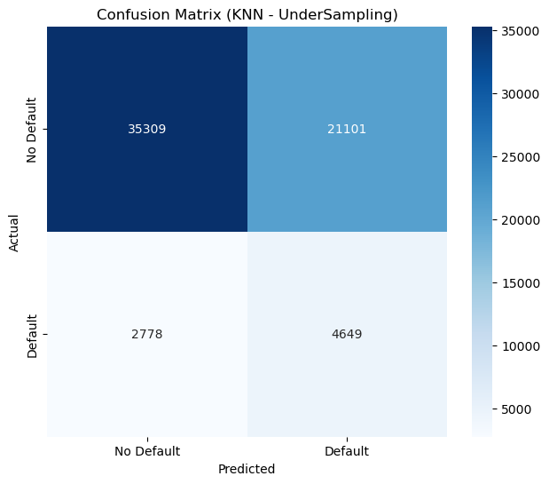
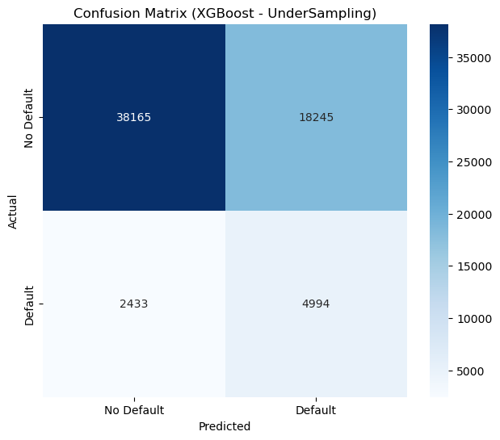

<div align="center">

<h1 style="font-size: 3em;">Predicting Loan Default</h1>  
<h2 style="font-size: 2em;">A Machine Learning Model and Analysis</h2>


</div>


---

## Executive Summary

This project leverages machine learning (ML) techniques to predict loan defaults using the Loan Default Prediction dataset from Kaggle. By applying classification models such as Logistic Regression, Random Forest, and others, the project aims to identify high-risk loans effectively. 

Advanced methods, including feature engineering, data encoding, oversampling, and model optimization, are employed to enhance predictive accuracy. These techniques help lenders proactively mitigate the risk of loan defaults, ensuring financial stability and sustained business success.

---

## Table of Contents
- [Executive Summary](#executive-summary)
- [Project Overview: Lender's Story](#project-overview-lenders-story)
- [Project Overview](#project-overview)
- [Goals](#goals)
- [Data Source](#data-source)
- [Installation](#installation)
- [Usage](#usage)
- [Methodology](#methodology)
- [Key Observations](#key-observations)
- [Visualizations](#visualizations)
- [Final Recommendation](#final-recommendation)
- [License](#license)

---

## Project Overview: Lender's Story

Woeful Banking Corp. (WBG) is in a critical turnaround situation due to its past emphasis on market share growth over profitability. This strategy has resulted in high levels of loan defaults, jeopardizing the company's financial stability. In the past year alone, WBG approved over 250,000 loans, amounting to $32.577 billion, generating $3.716 billion in interest income. However, this success was overshadowed by $4.285 billion in write-offs due to loan defaults, leaving the company with a net loss of $569 million before funding costs and other expenses.

To address this challenge, WBG enlisted Insight Consultancy Group (ICG), a team of seasoned professionals specializing in financial technology services, to analyze its loan dataset. The goal is to develop a data-driven lending program that minimizes defaults, increases profitability, and ensures the company’s long-term sustainability. 

ICG's approach focuses on leveraging machine learning to predict loan defaults, enabling WBG to identify and reject high-risk loans while minimizing lost revenue from unnecessarily rejecting reliable borrowers. The analysis culminates in a **Predicted Profit Analysis (PPA)**, which evaluates the profitability of loans predicted to be non-defaulting. Future lending decisions will be guided by this new framework to restore WBG’s financial health.

Important considerations in this initiative include:
- **Accuracy**: How reliably can we predict defaults?
- **Precision**: Are we correctly identifying defaulters while minimizing the rejection of good borrowers?
- **Impact**: What are the financial outcomes of these decisions, and how do they support WBG’s turnaround?

Through this balanced approach, WBG aims to implement ethical, profitable lending practices that secure its future while fostering trust and transparency.

---

## Project Overview

The objective of this project is to utilize advanced machine learning models to predict loan defaults and create a decision-making framework that reduces high-risk loans while maximizing profitable lending opportunities. The dataset for this analysis is imbalanced, with significantly more non-defaults than defaults, presenting unique challenges for model training and evaluation.

### Key Challenges and Goals:
1. **Imbalanced Data**: With far fewer defaults than non-defaults, the model must focus on correctly identifying the minority class without being biased toward the majority class.
2. **Performance Metrics**:
   - **Accuracy**: Often misleading in imbalanced datasets, as it may overly reflect the majority class performance.
   - **Precision**: Ensures flagged defaulters are truly high-risk borrowers.
   - **Recall**: Prioritizes identifying as many defaulters as possible, even at the expense of precision.
3. **Balancing Metrics**: Striking the right balance between recall, precision, and accuracy is essential for minimizing risk while maximizing lending opportunities.

This project applies a combination of machine learning techniques, including feature engineering, resampling methods (e.g., SMOTE, SMOTEENN), and hyperparameter tuning, to optimize model performance. The results are further evaluated using financial metrics to determine profitability and guide lending strategies.

---

### Goals
1. **Feature Engineering and Correlation**:
   - Derive new features from existing data to improve model performance.
   - Use a correlation matrix to identify relationships between variables and default outcomes, ensuring the model leverages the most predictive features.

2. **Minimum Preprocessing Case**:
   - Perform minimal preprocessing (encoding and standardization/scaling).
   - Train classification models such as Logistic Regression, Random Forest, Decision Tree, KNN, and XGBoost, and evaluate performance using metrics like accuracy, precision, and recall.

3. **Further Preprocessing Case**:
   - Apply advanced preprocessing, including resampling techniques like undersampling, oversampling, SMOTE, and SMOTEENN, to handle class imbalance and improve recall.

4. **Choose the Best Model**:
   - Evaluate models based on recall, accuracy, and precision.
   - Use confusion matrix data to simulate lending decisions, calculating the forecasted profits and selecting the model with the best financial and predictive performance.

Through this structured approach, WBG aims to implement a sustainable lending program that reduces loan defaults and restores profitability, ultimately securing its position in the competitive financial services market.


---

## Data Source

The dataset used in this project is **Loan_default.csv**, sourced from [Kaggle's Loan Default Prediction Dataset](https://www.kaggle.com/datasets/nikhil1e9/loan-default). This dataset was also featured in Coursera's Loan Default Prediction challenge. It includes **255,347 entries** and **18 columns**, providing information about borrowers and their loans.

### Column Descriptions
1. **LoanID**: A unique identifier for each loan.
2. **Age**: The age of the borrower (in years).
3. **Income**: The annual income of the borrower.
4. **LoanAmount**: The amount of money borrowed.
5. **CreditScore**: The credit score of the borrower, indicating their creditworthiness.
6. **MonthsEmployed**: The number of months the borrower has been employed.
7. **NumCreditLines**: The number of active credit lines the borrower has.
8. **InterestRate**: The interest rate applicable to the loan.
9. **LoanTerm**: The term length of the loan (in months).
10. **DTIRatio**: The Debt-to-Income ratio, showing the borrower's total debt as a percentage of their income.
11. **Education**: The borrower's highest level of education (PhD, Master's, Bachelor's, or High School).
12. **EmploymentType**: The borrower's employment status (Full-time, Part-time, Self-employed, or Unemployed).
13. **MaritalStatus**: The borrower's marital status (Single, Married, or Divorced).
14. **HasMortgage**: Whether the borrower has a mortgage (Yes or No).
15. **HasDependents**: Whether the borrower has dependents (Yes or No).
16. **LoanPurpose**: The purpose of the loan (Home, Auto, Education, Business, or Other).
17. **HasCoSigner**: Whether the loan has a co-signer (Yes or No).
18. **Default**: The target variable, indicating whether the loan defaulted (1 for default, 0 for non-default).

### Additional Notes
- The **Default** column is highly imbalanced, with only ~11.6% of loans defaulting.
- This dataset is ideal for classification problems due to the binary nature of the target variable.
- Feature engineering and preprocessing were applied to enhance the dataset and improve model performance.

---


## Installation

1. **Clone the repository**
   ```bash
   git clone https://github.com/wrdhall3/loan-default-project.git
   
   cd loan-default-project

2. **Install Dependencies**
Ensure all required packages are installed. You can install them using:
pip install pandas
pip install matplotlib
pip install scikit-learn
pip install seaborn
pio install imbalanced-learn

3. **Dependencies**
Below is the core set of dependencies used in this project:
```python
# Core libraries for data manipulation and visualization
import pandas as pd
import numpy as np
import matplotlib.pyplot as plt
import seaborn as sns

# Machine Learning libraries and models
from sklearn.model_selection import train_test_split, GridSearchCV, RandomizedSearchCV
from sklearn.linear_model import LogisticRegression
from sklearn.ensemble import RandomForestClassifier
from sklearn.tree import DecisionTreeClassifier
from sklearn.neighbors import KNeighborsClassifier
from xgboost import XGBClassifier  # Requires XGBoost library installation

# Data preprocessing
from sklearn.preprocessing import StandardScaler, MinMaxScaler
from sklearn.preprocessing import OneHotEncoder, OrdinalEncoder
from sklearn.compose import ColumnTransformer
from sklearn.pipeline import Pipeline

# Evaluation metrics
from sklearn.metrics import accuracy_score, precision_score, recall_score, f1_score, roc_auc_score
from sklearn.metrics import confusion_matrix, classification_report, roc_curve, auc

# Handling imbalanced datasets
from imblearn.under_sampling import RandomUnderSampler
from imblearn.over_sampling import RandomOverSampler, SMOTE
from imblearn.combine import SMOTEENN

# Miscellaneous utilities
from collections import Counter
import warnings
warnings.filterwarnings('ignore')  # Suppress warnings for cleaner output
```
--- 

## Usage

### Running the Notebook
1. Open the `loan_default_project.ipynb` notebook in a Jupyter Notebook environment or any compatible IDE (e.g., JupyterLab, VS Code with Python extensions).
2. Ensure all required dependencies are installed in your environment (refer to the `Dependencies` section in the README).
3. Run the notebook cell by cell to execute the workflow, from data retrieval and preprocessing to model training, evaluation, and visualization.

### Data Retrieval and Preparation
- The notebook loads the dataset `Loan_default.csv`, which contains loan information, borrower details, and loan default outcomes.
- The dataset is cleaned and preprocessed, including:
  - Handling missing values (if any).
  - Encoding categorical features using `OneHotEncoder` and `OrdinalEncoder`.
  - Scaling numerical features using `StandardScaler`.

### Data Analysis and Visualization
- The notebook includes exploratory data analysis (EDA) to understand the dataset:
  - **Descriptive Statistics**: Summary statistics for all features.
  - **Correlation Analysis**: A correlation matrix to identify relationships between variables.
  - **Data Distribution**: Visualizations, including histograms, box plots, and bar charts, for better feature understanding.
- Statistical tables and visualizations are generated to illustrate:
  - Class distribution (e.g., default vs. non-default).
  - Feature importance from trained models.

### Model Training and Evaluation
- The notebook trains multiple classification models, including Logistic Regression, Decision Tree, Random Forest, KNN, and XGBoost, to predict loan defaults.
- Evaluation metrics such as accuracy, precision, recall, F1-score, and AUC-ROC are used to assess model performance.
- Confusion matrices and other visualizations are provided to analyze the models’ predictions.

### Profitability Analysis
- A **Predicted Profit Analysis (PPA)** evaluates the financial impact of lending decisions based on each model's predictions.
- The notebook computes financial metrics, including yield, net yield, and profitability status, for different lending scenarios.

By following the notebook, you can replicate the entire process, from data loading to financial evaluation, and gain insights into the most effective model for predicting loan defaults and maximizing profitability.


---

## Methodology

To identify the best classification model and preprocessing approach, we followed a systematic methodology to analyze the loan dataset. Below is an outline of the steps taken:

### 1. **Data Collection and Preparation**
- The dataset was sourced from Kaggle's Loan Default Prediction Dataset and contains **255,347 records** across **18 columns**.
- The data represents the borrower's financial status at the point of loan application.
- The `LoanID` column (a unique identifier) was removed as it had no predictive value.

### 2. **Exploratory Data Analysis (EDA)**
- **Descriptive Statistics**: Histograms and statistical summaries were generated to examine the distribution of numerical and categorical features.
- **Missing Values**: The dataset had no missing values.
- **Outliers**: No apparent outliers, indicating that the data may have been curated or synthetically generated.
- **Features**:
  - Excluding `LoanID`, the dataset has **16 features**: **9 numerical** and **7 categorical**.
  - The target variable `Default` is imbalanced:
    - **Non-defaults (0)**: 88.4%.
    - **Defaults (1)**: 11.6%.

### 3. **Feature Engineering and Correlation Analysis**
- A correlation matrix was computed for numerical features to identify relationships with `Default`:
  - The strongest correlations were **Age** (-0.168) and **InterestRate** (0.131).
- New features were created to explore additional relationships:
  - `Financial_Obligations`: Combined `HasMortgage` and `HasDependents`.
  - `LoanAmountToIncomeRatio` and `TotalDebtToIncomeRatio`: Ratios derived from existing features.
  - None of the new features showed significant correlation with `Default` and were excluded.

### 4. **Data Cleaning and Processing**
- **Feature Scaling**:
  - Numerical columns were standardized to prevent large values from dominating smaller ones.
- **Encoding**:
  - OrdinalEncoder was applied to `Education` to impose a hierarchy (e.g., PhD > High School).
  - OneHotEncoder was used for other categorical columns.
- **Imbalanced Target Handling**:
  - The target variable `Default` was heavily imbalanced. Sampling techniques were employed:
    - **Oversampling** (SMOTE).
    - **Undersampling**.
    - **Combined Resampling** (SMOTEENN).
- **Model Training**:
  - Five classification models were trained: Logistic Regression, Random Forest, Decision Tree, KNN, and XGBoost.
  - For each model, `classification_report` was used to evaluate metrics such as accuracy, precision, and recall.

### 5. **Analysis**
- **Focus on Recall**: Since the data is imbalanced, priority was given to improving recall (identifying as many defaulters as possible) at the cost of reduced precision and accuracy.
- **Model Evaluation**:
  - Iterative improvements were assessed using the confusion matrix and classification reports.
  - Balancing recall and precision was critical to ensuring both financial and operational feasibility.
- **Business Analysis**:
  - Predicted non-default loans were considered for approval, and predicted defaults were denied.
  - A net positive yield (interest income from good loans minus losses from bad loans and funding costs) was the primary business objective.

### 6. **Visualization and Findings**
- Visualizations, including confusion matrices and performance charts, were created to compare model results.
- **Confusion Matrix**: Evaluated the performance of each model by summarizing predictions against actual outcomes.
- **Portfolio Analysis**:
  - Predicted outcomes were used to construct a loan portfolio:
    - **Good loans** (correctly predicted non-defaults) generate interest income.
    - **Bad loans** (missed defaults) result in write-offs.
  - A net positive yield of at least **1.50%** ensures business sustainability.
  - If the yield is negative, the financial model becomes non-viable.

---

This methodology provided a robust framework for analyzing loan defaults, enabling the selection of models that balance recall, precision, and accuracy to meet business objectives effectively.

---

# Key Observations
### Logistic Regression Model
1. **Imbalanced Dataset**:
   - **Metrics**: Precision: 63%, Recall: 7%, Accuracy: 88.7%.
   - **Strengths**: High precision for default predictions.
   - **Weaknesses**: Very low recall, identifying only 7% of defaulters.
   - **Confusion Matrix**:
     - Defaults correctly identified: 531 (true positives).
     - Non-defaults correctly identified: 56,103 (true negatives).
     - Missed defaulters: 6896 (false negatives).
     - Incorrectly flagged non-defaults: 307 (false positives).
2. **Undersampling**:
   - **Metrics**: Precision: 23%, Recall: 69%, Accuracy: 69.2%, F1-Score: 34%.
   - **Strengths**: Significantly improved recall for defaulters, making it effective at identifying high-risk loans.
   - **Weaknesses**: Trade-off in precision and increased false positives.
   - **Confusion Matrix**:
     - Defaults correctly identified: 5,102 (true positives).
     - Non-defaults correctly identified: 39,102 (true negatives).
     - Missed defaulters: 2,325 (false negatives).
     - Incorrectly flagged non-defaults: 17,308 (false positives).
---
### Random Forest Model
1. **Imbalanced Dataset**:
   - **Metrics**: Precision: 62%, Recall: 5%, Accuracy: 88.5%, F1-Score: 9%.
   - **Strengths**: High precision and overall accuracy.
   - **Weaknesses**: Recall remains very low, limiting its ability to identify defaulters.
   - **Confusion Matrix**:
     - Defaults correctly identified: 364 (true positives).
     - Non-defaults correctly identified: 56185 (true negatives).
     - Missed defaulters: 7,063 (false negatives).
     - Incorrectly flagged non-defaults: 225 (false positives).
2. **Oversampling**:
   - **Metrics**: Precision: 22%, Recall: 66%, Accuracy: 68.8%, F1-Score: 33%.
   - **Strengths**: Balanced dataset significantly improved recall.
   - **Weaknesses**: Increased false positives reduced precision and accuracy.
   - **Confusion Matrix**:
     - Defaults correctly identified: 4,905 (true positives).
     - Non-defaults correctly identified: 39,076 (true negatives).
     - Missed defaulters: 2,522 (false negatives).
     - Incorrectly flagged non-defaults: 17,334 (false positives).
---
### Decision Tree Model
1. **Imbalanced Dataset**:
   - **Metrics**: Precision: 20%, Recall: 24%, Accuracy: 80%, F1-Score: 22%.
   - **Strengths**: Moderate recall improvement over Logistic Regression.
   - **Weaknesses**: Precision and accuracy were affected due to imbalance.
   - **Confusion Matrix**:
     - Defaults correctly identified: 6,977 (true positives).
     - Non-defaults correctly identified: 49,433 (true negatives).
     - Missed defaulters: 5,675 (false negatives).
     - Incorrectly flagged non-defaults: 1,752 (false positives).
2. **Oversampling**:
   - **Metrics**: Precision: 22%, Recall: 66%, Accuracy: 68.8%, F1-Score: 33%.
   - **Strengths**: Balanced dataset improved recall significantly.
   - **Weaknesses**: Increased false positives reduced precision.
   - **Confusion Matrix**:
     - Defaults correctly identified: 4,905 (true positives).
     - Non-defaults correctly identified: 39,076 (true negatives).
     - Missed defaulters: 2,522 (false negatives).
     - Incorrectly flagged non-defaults: 17,334 (false positives).
---
### KNN Classifier
1. **Imbalanced Dataset**:
   - **Metrics**: Precision: 36%, Recall: 9%, Accuracy: 87.5%, F1-Score: 15%.
   - **Strengths**: Moderate precision but very low recall limits effectiveness.
   - **Confusion Matrix**:
     - Defaults correctly identified: 677 (true positives).
     - Non-defaults correctly identified: 55,231 (true negatives).
     - Missed defaulters: 6,750 (false negatives).
     - Incorrectly flagged non-defaults: 1,179 (false positives).
2. **Undersampling**:
   - **Metrics**: Precision: 18%, Recall: 63%, Accuracy: 62.6%, F1-Score: 28%.
   - **Strengths**: Recall improved with undersampling.
   - **Weaknesses**: Significant increase in false positives, reducing precision.
   - **Confusion Matrix**:
     - Defaults correctly identified: 4,649 (true positives).
     - Non-defaults correctly identified: 35,309 (true negatives).
     - Missed defaulters: 2,778 (false negatives).
     - Incorrectly flagged non-defaults: 21,101 (false positives).
---
### XGBoost Classifier
1. **Imbalanced Dataset**:
   - **Metrics**: Precision: 55%, Recall: 8%, Accuracy: 88.5%, F1-Score: 14%.
   - **Strengths**: High precision and overall accuracy.
   - **Weaknesses**: Low recall limits its ability to identify defaulters.
   - **Confusion Matrix**:
     - Defaults correctly identified: 606 (true positives).
     - Non-defaults correctly identified: 55,912 (true negatives).
     - Missed defaulters: 6,821 (false negatives).
     - Incorrectly flagged non-defaults: 498 (false positives).
2. **Undersampling**:
   - **Metrics**: Precision: 21%, Recall: 67%, Accuracy: 67.6%, F1-Score: 33%.
   - **Strengths**: Balanced performance with improved recall.
   - **Weaknesses**: Increased false positives.
   - **Confusion Matrix**:
     - Defaults correctly identified: 4,994 (true positives).
     - Non-defaults correctly identified: 38,165 (true negatives).
     - Missed defaulters: 2,433 (false negatives).
     - Incorrectly flagged non-defaults: 18,245 (false positives).
---
## Summary of Models:
1. **Best Model Overall**: Logistic Regression with Undersampling:
   - **Metrics**: Precision: 23%, Recall: 69%, Accuracy: 69.2%, F1-Score: 34%.
   - **Reason**: Achieved the best balance between recall and precision while maintaining acceptable accuracy.
2. **Best Recall**: Logistic Regression with Undersampling (69%).
3. **Trade-offs**:
   - Models like XGBoost with undersampling provided comparable recall but suffered from lower precision and increased false positives.

--- 

### Final Recommendation:

Logistic Regression with Undersampling is the most effective model for this task, given its balanced metrics and ability to identify a higher proportion of defaulters without sacrificing too much precision or accuracy.

---

## Visualizations

### Model Performance Comparisons

The following charts and confusion matrices showcase the performance of various models tested during the project. Each model is evaluated under different techniques (e.g., undersampling and oversampling) to handle the class imbalance present in the dataset. The models compared include Logistic Regression, Decision Tree, Random Forest, KNN, and XGBoost.

---

### 1. Logistic Regression (Best Model)

#### **Performance Metrics Comparison**
- **Undersampling**:
  - **Precision**: 23%
  - **Recall**: 69%
  - **Accuracy**: 69.2%
  - **F1-Score**: 34%
  - **Key Strengths**: Achieved the best recall among all models while maintaining a good balance between precision and F1-score. This makes it the most effective model for identifying high-risk loans.
  - **Key Weaknesses**: Increased false positives due to the focus on improving recall.

#### **Confusion Matrix for Logistic Regression (Undersampling)**


---

### 2. Random Forest

#### **Performance Metrics Comparison**
- **Oversampling**:
  - **Precision**: 22%
  - **Recall**: 66%
  - **Accuracy**: 68.8%
  - **F1-Score**: 33%
  - **Key Strengths**: Balanced performance with strong recall improvement.
  - **Key Weaknesses**: Increased false positives, reducing precision and overall accuracy.

#### **Confusion Matrix for Random Forest (Oversampling)**


---

### 3. Decision Tree

#### **Performance Metrics Comparison**
- **Oversampling**:
  - **Precision**: 22%
  - **Recall**: 66%
  - **Accuracy**: 68.8%
  - **F1-Score**: 33%
  - **Key Strengths**: Improved recall through oversampling, capturing a significant proportion of defaults.
  - **Key Weaknesses**: Moderate precision due to a higher rate of false positives.

#### **Confusion Matrix for Decision Tree (Oversampling)**


---

### 4. KNN Classifier

#### **Performance Metrics Comparison**
- **Undersampling**:
  - **Precision**: 18%
  - **Recall**: 63%
  - **Accuracy**: 62.6%
  - **F1-Score**: 28%
  - **Key Strengths**: Moderate recall improvement with undersampling.
  - **Key Weaknesses**: Very low precision due to a high rate of false positives.

#### **Confusion Matrix for KNN (Undersampling)**


---

### 5. XGBoost

#### **Performance Metrics Comparison**
- **Undersampling**:
  - **Precision**: 21%
  - **Recall**: 67%
  - **Accuracy**: 67.6%
  - **F1-Score**: 33%
  - **Key Strengths**: Balanced recall improvement.
  - **Key Weaknesses**: Lower precision and increased false positives compared to Logistic Regression.

#### **Confusion Matrix for XGBoost (Undersampling)**


---

# Observations and Key Takeaways

## Strengths and Weaknesses by Model

- **Logistic Regression (Undersampling)**:  
  - **Strengths**: Achieved the highest recall (69%) among all models, making it the most effective at identifying defaulters. It maintained a reasonable trade-off with precision (23%) and F1-score (34%). The simplicity and interpretability of Logistic Regression also make it ideal for business applications.
  - **Weaknesses**: Increased false positives due to the focus on improving recall, which slightly reduced overall accuracy.
 
- **Random Forest (Oversampling)**:  
  - **Strengths**: Provided a good balance of recall (66%) and F1-score (33%). Its ensemble nature improves prediction stability.  
  - **Weaknesses**: While recall was high, the increased false positives made it less precise, and the complexity of the model can hinder interpretability for stakeholders.

- **Decision Tree (Oversampling)**:  
  - **Strengths**: Improved recall (66%) and F1-score (33%) compared to the baseline Logistic Regression model. Oversampling helped balance the dataset and identify more defaulters.  
  - **Weaknesses**: Moderate precision (22%) led to an increase in false positives, reducing its reliability compared to Logistic Regression.

- **KNN (Undersampling)**:  
  - **Strengths**: Moderate recall (63%) with a simple, interpretable algorithm.  
  - **Weaknesses**: Low precision (18%) and F1-score (28%) due to a high rate of false positives. KNN underperformed compared to both Logistic Regression and Random Forest.

- **XGBoost (Undersampling)**:  
  - **Strengths**: Balanced recall (67%) and F1-score (33%) compared to KNN. The model handles complex relationships effectively.  
  - **Weaknesses**: Lower precision (21%) and increased complexity compared to Logistic Regression make it less practical for real-world implementation.

---

## Recommendations

1. **Adopt Logistic Regression (Undersampling)**:  
   - Logistic Regression with undersampling consistently outperformed other models in terms of recall, precision, and profitability. Its simplicity and interpretability make it ideal for lending decisions where identifying defaulters is critical.  

2. **Continuous Improvement**:  
   - **Threshold Tuning**: Adjust thresholds to further refine the balance between recall and precision, aligning with business objectives.  
   - **Model Retraining**: Periodically retrain the model using updated data to adapt to changing borrower behaviors.

3. **Validate Financial Outcomes**:  
   - Use the **Predicted Profit Analysis Tool** to validate the model's profitability periodically. Ensure that the tool incorporates updated interest rates and funding costs to reflect real-world conditions.

4. **Monitor Business Metrics**:  
   - Track metrics such as default rates, profitability, and customer retention to ensure the model delivers sustainable business outcomes.

---

## Final Recommendation: Logistic Regression (Undersampling)

Logistic Regression with undersampling demonstrated the best overall performance by delivering the highest interest income and loan yield. After comprehensive evaluations, **Logistic Regression with Undersampling** emerged as the top-performing model. This determination was based on a detailed analysis of classification metrics (recall, precision, F1-score, and accuracy) combined with real-world financial insights derived from the **Predicted Profit Analysis Tool**.


---

### Why Logistic Regression with Undersampling Is Recommended

#### 1. Performance Metrics:
- **Recall**: Achieved the highest recall (69%) among all models, ensuring a significant proportion of defaulters are correctly identified.  
- **Precision**: Although precision (23%) was lower than other models, it was an acceptable trade-off for the improved recall, which minimizes missed defaults.  
- **F1-Score**: Delivered a balanced F1-score (34%), highlighting an effective trade-off between recall and precision.  
- **Accuracy**: Maintained a reasonable accuracy (69.2%), demonstrating that the model performed well overall despite the focus on recall.

#### 2. Financial Model Insights:
- The **Predicted Profit Analysis Tool** revealed that Logistic Regression with Undersampling consistently delivered the highest net yield and profitability compared to other models.  
- By prioritizing recall, the model successfully reduced losses from defaults, leading to maximized income from approved loans and improved profitability.

#### 3. Business Application:
- The simplicity and interpretability of Logistic Regression make it an excellent choice for stakeholders who require transparent, actionable insights into lending decisions.  
- The model’s efficiency ensures rapid deployment and scalability across various lending portfolios, making it practical for real-world business applications.

### Predicted Profit Analysis Tool

#### Overview

The **Predicted Profit Analysis Tool (PPA)** evaluates the financial viability of machine learning models applied to loan default predictions. By analyzing key metrics derived from confusion matrix outputs, it identifies the model that delivers the best balance between accuracy, recall, and profitability.

---

#### Features

1. **Standardized Financial Metrics**:  
   - Ensures fair model evaluation by standardizing metrics such as total loans, interest income, and loan yield.

2. **Model Evaluation**:  
   - Compares machine learning models (e.g., Logistic Regression, Random Forest, XGBoost, Decision Tree, KNN) based on their ability to maximize recall while maintaining profitability.

3. **Profitability Assessment**:  
   - Highlights the best-performing model and its potential to maximize returns while minimizing loan defaults.


---

### Logistic Regression - Undersampling

|                     | Predicted N (Negative) | Predicted P (Positive) |
|---------------------|------------------------|------------------------|
| **Actual N (Non-default)** | 39,102                 | 17,308                 |
| **Actual P (Default)**      | 2,325                  | 5,102                  |

**Predicted Accuracy**: 0.69  
**Predicted Precision**: 0.23  
**Predicted Recall**: 0.69  

---

### Predicted Profit Analysis (PPA)

|                     | Non-default (0) | Default (1)  |
|---------------------|-----------------|--------------|
| **Actual**          | 39,102          | 2,325        |

**Interest Rate**: 13%  
**Interest Income**: $5.083M  
**Before Cost of Deposit**: $2.758M  

|                     |                  |
|---------------------|------------------|
| **Yield**           | 6.66%           |
| **Cost of Fund (Deposits)** | 4.00%           |
| **Net Yield**       | 2.66%           |


---

#### Predicted Profit Analysis Results

| Model                   | Sampling      | Accuracy | Precision | Recall | Int. Income ($M) | Loan Yield (%) |
|-------------------------|---------------|----------|-----------|--------|------------------|----------------|
| **Logistic Regression** | Undersampling | **0.69**     | **0.23**      | **0.69**   | **2.758**        | **6.66**       |
| **Random Forest**       | Oversampling  | 0.69     | 0.22      | 0.66   | 2.558            | 6.15           |
| **Decision Tree**       | Oversampling  | 0.69     | 0.22      | 0.66   | 2.558            | 6.15           |
| **KNN**                 | Undersampling | 0.63     | 0.18      | 0.61   | 1.812            | 4.76           |
| **XGBoost**             | Undersampling | 0.68     | 0.21      | 0.67   | 2.528            | 6.23           |


---
This tool validated the project’s hypothesis, affirming **Logistic Regression with Undersampling** as the optimal model to minimize loan defaults and maximize financial stability.

---

#### Observations and Recommendations

1. **Best Model: Logistic Regression (Undersampling)**  
   - **Highest Recall (0.69)**: Identifies the highest proportion of actual defaulters.
   - **Highest Interest Income ($2.758M)**: Maximizes profitability by minimizing the financial losses from defaults.
   - **Best Loan Yield (6.66%)**: Offers the best return on loans approved.

2. **Other Models**:
   - **XGBoost**: Achieves comparable recall but slightly lower profitability ($2.528M).  
   - **KNN**: Demonstrates weaker recall (0.61) and loan yield (4.76%), making it less viable.  
   - **Random Forest & Decision Tree**: Similar performance metrics but fall short in profitability compared to Logistic Regression.

3. **Recommendation**:  
   Adopt **Logistic Regression with Undersampling** as the primary model for predicting loan defaults. Its simplicity, high recall, and profitability make it the most effective choice for minimizing risks while maximizing financial returns.

---

#### Key Metrics Explained

1. **Accuracy**: The overall percentage of correct predictions.
2. **Precision**: The proportion of predicted defaults that were actual defaults.
3. **Recall**: The proportion of actual defaults correctly predicted (most critical metric for this task).  
4. **Interest Income**: Revenue generated from non-defaulting loans.  
5. **Loan Yield**: Interest income as a percentage of total loans issued.

---

#### Why Logistic Regression with Undersampling?

1. **Superior Recall**: The highest recall ensures that the majority of defaulters are accurately identified, minimizing financial risks.  
2. **Profitability**: The model delivers the highest interest income and loan yield, making it the most viable for practical deployment.  
3. **Interpretability**: Logistic Regression’s simplicity aids in stakeholder communication and operational integration.

---

##  MIT License

This project is licensed under the MIT License. The dataset and analysis are provided for **educational purposes only** and are intended to demonstrate machine learning techniques for academic and learning use cases.

**Disclaimer**: This project is not designed for commercial or production use in financial decision-making. Users are advised not to rely on this analysis for real-world lending or credit risk evaluation.

[Back to Top](#table-of-contents)
